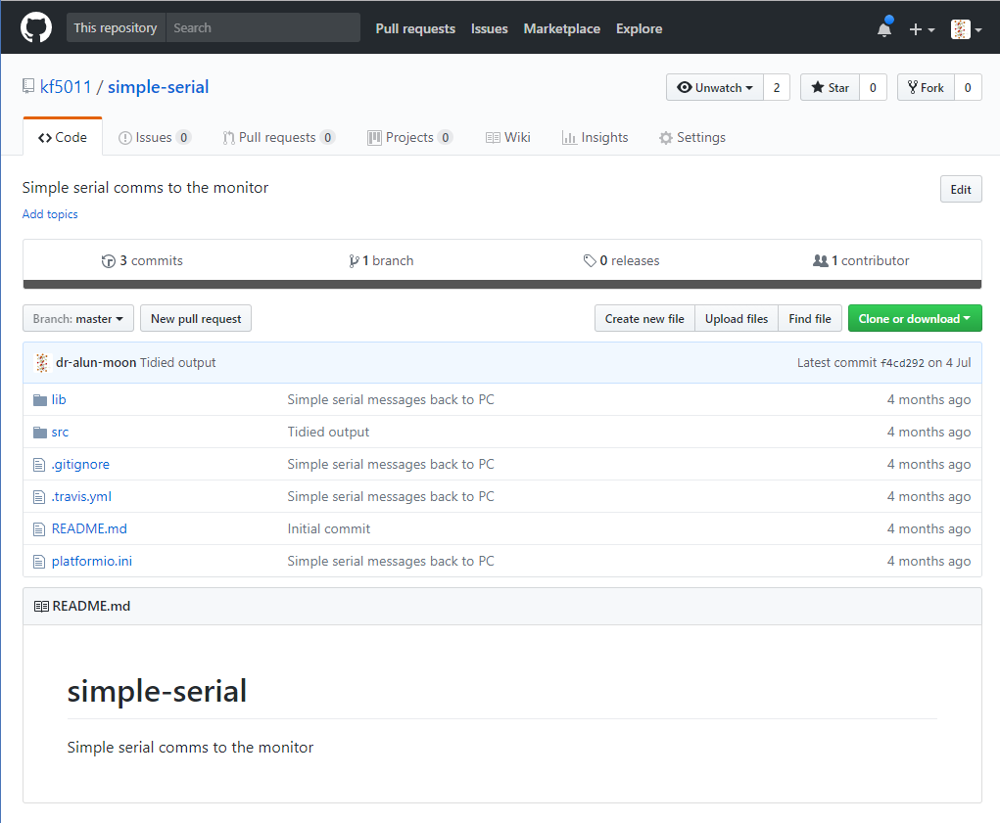
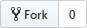
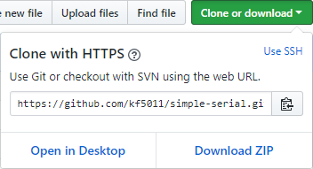
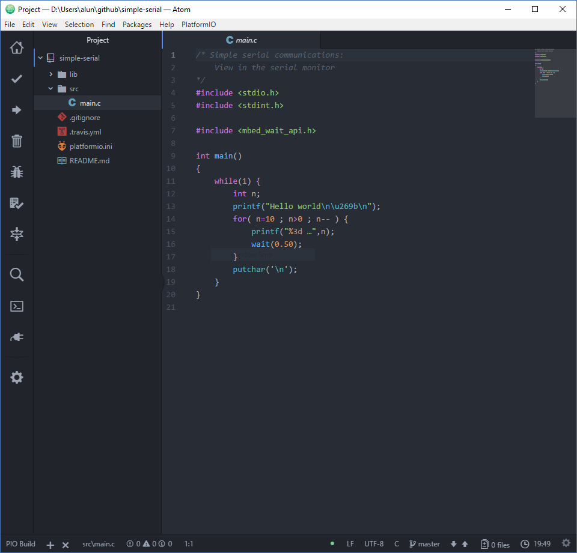
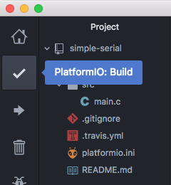
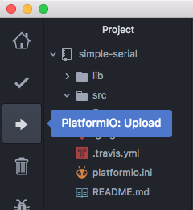
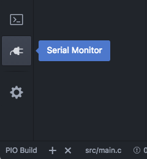
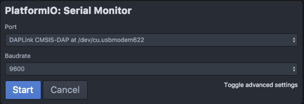
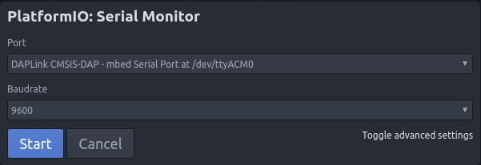

# Getting started
This is a quick guide to getting started using [Git](https://github.com), [Atom](https://atom.io), and [PlatformIO](http://platformio.org), in the context of this module.

# Workflow
The basic pattern for the lab classes, and ultimately the assignment, is:

 1. [Fork](#forking-a-repository) the repository on Github.
 2. [Clone](#cloning-the-repository) the repository on the local machine.
 3. [Work](#working-on-the-project) on the project
    1. Make changes
       1. [Edit](#editing)
       2. [Compile](#building)
       3. [Upload](#uploading)
       4. [Evaluate](#evaluate)
    2. [Commit changes](#commit-changes)
 5. [Push updates](#push-to-repository) back to Github server.

# Github repository
The exercises for the practical sessions and the base skeleton for the assignment will be distributed via Github.  Github is a very good tool for managing and distributing source code.

## Lab material
Lab material will be distributed via public repositories, linked to from the module pages.  While you can download a .zip file containing the source, or clone the public repository, a better option is to fork the repository (which requires a Github account).



# Forking a repository
Look for the fork button  near the top right of the page.  _You will need to be signed into your gitub account_

Creating a fork, makes a copy of the repository under your id, you can then make changes to your copy, and log them back onto github servers.

 > Since the original repositories are public, your initial repository
 > will also be public.
 >
 > To make a private copy see the Github help page on
 > [Duplicating a repository](https://help.github.com/articles/duplicating-a-repository/)

# Cloning the repository
Making a clone of the repository, makes a local copy of the files that you can work on.  Although there are some good GUI based tools, personally I've found that the command shell tool the most convenient for this stage.

To clone the repository click on the green "Clone or download" button
  You will see a drop down box with a url and a copy icon.



You can pset the url into the command line for the `git clone` command

   ```shell_session
    $ git clone https://github.com/kf5011/simple-serial.git
   ```
   {: .code}

If it clones sucessfully you'll see something like

   ```shell_session
   $ git clone https://github.com/kf5011/simple-serial.git
   Cloning into 'simple-serial'...
   remote: Counting objects: 17, done.
   remote: Total 17 (delta 0), reused 0 (delta 0), pack-reused 17
   Unpacking objects: 100% (17/17), done.
   $
   ```
   {:  .example}

You can now open the folder that has just been created in Atom through the "Add Project Folder" command.

> On my machine since I am already in the command shell I
> just type
>   ```shell_session
>   $ atom simple-serial
>   ```
>   {:  .code}
>
> or something like
>   ```shell_session
>   $ cd simple-serial
>   $ atom .
>   ```
>   {:  .code}
{:  .example}

# Working on the Project
[Atom](https://atom.io) and [PlatformIO](http://platformio.org/) provide a good environment for writing program code.



{: style="float:left; margin-right:1em"}
## Editing
The code can be edited and saved just as with any editor (it's just text after all)

## Building
The build button on the toolbar, launches the build process.  The status and progression of the build is seen in another smaller sub-window.

For the first run of the build, this can take time as the process may have to download and compile libraries and tools used.

{: style="clear:both"}

{: style="float:left; margin-right:1em"}
## Uploading
Once the code is built, it will need transfering (*uploading*) to the K64F device.  The **Upload** button launches this process using the USB connection to the device.  Usually this automatically finds the correct device.  On occasion it doesn't, I've found that closing Atom, unplugging the K64F then, first reconnecting the K64F _then_ starting Atom usually clears this up.

> On linux machines sometimes there is an additional error that crops up.  The user needs to be a member of the `dialout` group.  You can check your group memberships with the `groups` command.
>
> if you need to add yourself to the group on the University Linux machines you can use the command.
>    ```shell_session
>    $ sudo useradd student dialout
>    ```
>    {:  .code}
{:  .warning}

{: style="float:left; margin-right:1em"}
## Evaluate
You need to check if the program is functioning correctly.

While the k64f doesn't have a screen or keyboard, you can get some communications back to Atom/PlatformIO via the USB cable.

### Serial communications
In the program running on the K64F you can use the standard-IO-library and `printf`, `puts`, and other console output.  To see it in Atom, you need to open the _Serial Monitor_.  The **Port** you need to select in the Dialog box will be labeled with "DAPLink CMSIS-DAP", the exact port depends on the host machine and the host operating system.

You can also send data to the K64F from the Serial-Monitor, text entered here can be read on the K64F with `scanf`, `getchar`, etc





# Commit changes
Once you have a stable set of changes and want to record this point, you can commit them into the repository.

First you have to _stage_ the files that you want to record,

   ```shell_session
   $ git add src/main.
   ```
   {:  .code}

Then once all the files of interest are staged, you can make the commit,

   ```shell_session
   $ git commit -m "Commit message/summary of changes"
   ```
   {:  .code}

   Latest versions of Atom have a `github` package to help with the stage, commit, and push operations.  It can clone public repositories, but has problems with any that need an id/password.
   {:  .note}

# Push to repository
Once you have finished working, you will want to put the local changes you have made back onto the server, using the `push` operation
   ```shell_session
   $ git push
   ```
   {:  .code}
